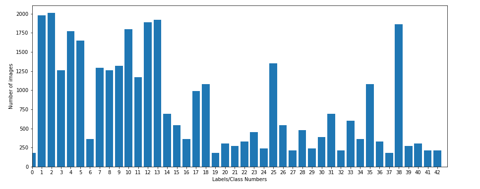
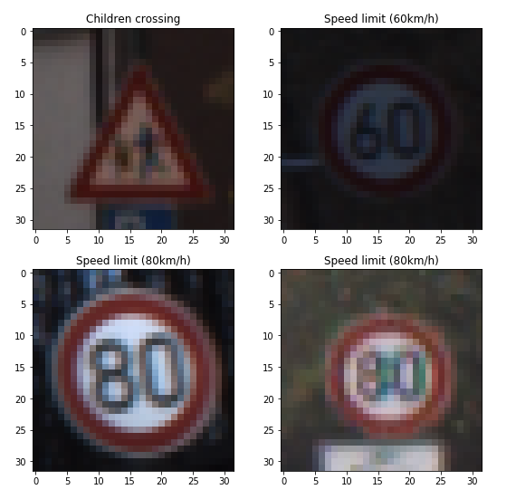
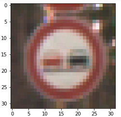
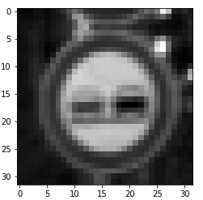
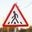
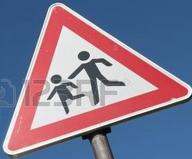
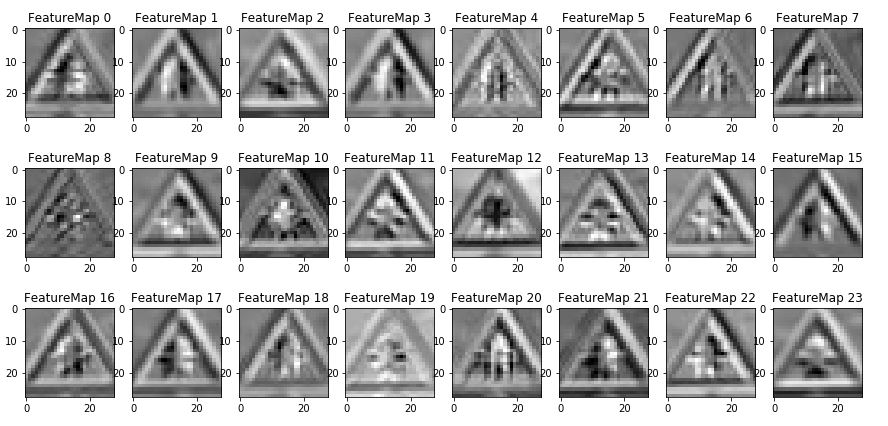
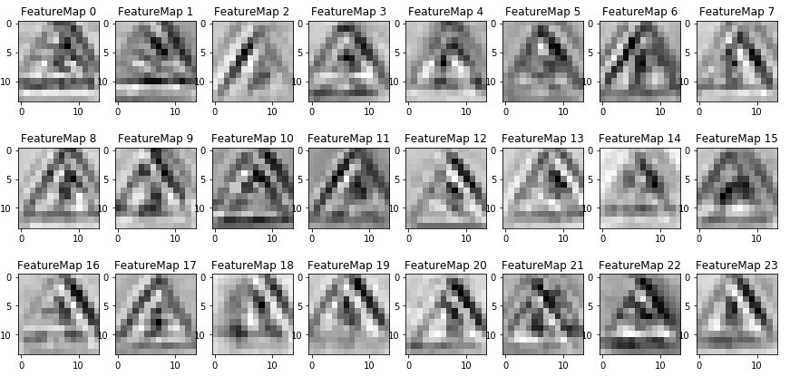
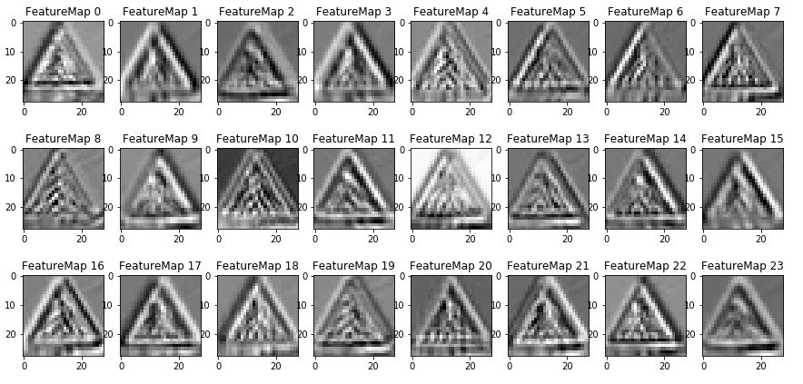
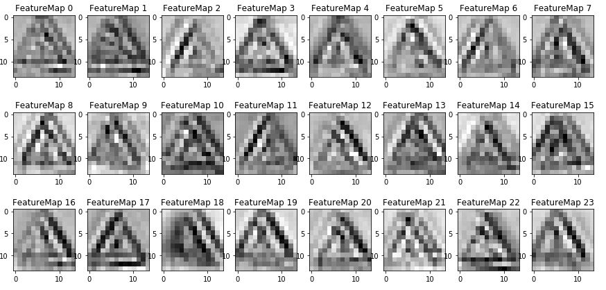

# Traffic Sign Recognition

## Overview

This project aims at recognising and classifying german traffic signs.

The steps of this project are the following:
* Load the dataset
* Summarize, explore and Visualize the dataset
* Design, train and test a model architecture
* Use the model to make predictions on new images
* Analyze the softmax probabilities of the new images

This project also includes visualization of the neural network for a test image.

## Data Set Summary & Exploration

Dataset used in this project contains RGB images of german traffic signs' of size 32x32 pixels.

Following are details acquired by using inbuilt functions in python:
1. Number of images in training set: 34799
2. Number of images in validation set: 4410
3. Number of images in test set: 12630
4. Shape of the images: (32, 32, 3)
5. Number of unique classes/labels in dataset: 43

Following chart shows the distribution of images in different classes in training set:

Following are few random images from the training dataset:

 

It can be observed in the images that there is no useful information near the edges. Images in the dataset are taken in different lighting conditions. Number of rotated images is negligible. Most of the images are not rotated or tilted, except a few which are slightly rotated or tilted, but shouldn't make any difference.

## Design and Test a Model Architecture

The model architecture consists of the following components:
* Data pre-processing
* Model architecture
* Training the model
* Output of the model

### Data Pre-processing

Dataset consists of 32x32 pixels RGB images of German traffic signs. Shape of the images in this case is more important than the color. So, even if images are taken in different lighting conditions, shape can still match. So, following pre-processing is done on the source images:
* Convert to grayscale (32x32) and reshape to 32x32x1
* Normalize the image using the following formula:
    pixel = (pixel - 128)/128
* Shuffle the data set before each epoch

Following is the snapshot of an image before and after grayscaling:
<table>
<tr>
    <td></td>
    <td></td>
</tr>
</table>

Shuffling the data helps in randomising the training process each time when model is run.

### Model Architecture

The model consists of the following layers:

<table style="border:1px solid #cccccc">
<thead>
    <tr style="border-bottom:1px solid #cccccc">
        <th style="text-align:center;border-right:1px solid #cccccc">Layer</th>
        <th style="text-align:center">Description</th>
    </tr>
</thead>
<tbody>
    <tr style="border-bottom:1px solid #cccccc">
        <td style="text-align:center;border-right:1px solid #cccccc">Input</td>
        <td style="text-align:center">Grayscale image reshaped to 32x32x1</td>
    </tr>
    <tr style="border-bottom:1px solid #cccccc">
        <td style="text-align:center;border-right:1px solid #cccccc">Convolution 5x5</td>
        <td style="text-align:center">1x1 stride, VALID padding, output 28x28x24</td>
    </tr>
    <tr style="border-bottom:1px solid #cccccc">
        <td style="text-align:center;border-right:1px solid #cccccc">RELU</td><td></td>
    </tr>
    <tr style="border-bottom:1px solid #cccccc">
        <td style="text-align:center;border-right:1px solid #cccccc">Max pooling 5x5</td>
        <td style="text-align:center">2x2 stride, SAME, padding, output 14x14x24</td>
    </tr>
    <tr style="border-bottom:1px solid #cccccc">
        <td style="text-align:center;border-right:1px solid #cccccc">Convolution 5x5</td>
        <td style="text-align:center">1x1 stride, SAME padding, output 14x14x68</td>
    </tr>
    <tr style="border-bottom:1px solid #cccccc">
        <td style="text-align:center;border-right:1px solid #cccccc">RELU</td><td></td>
    </tr>
    <tr style="border-bottom:1px solid #cccccc">
        <td style="text-align:center;border-right:1px solid #cccccc">Max pooling 5x5</td>
        <td style="text-align:center">2x2 stride, SAME padding, output 7x7x68</td>
    </tr>
    <tr style="border-bottom:1px solid #cccccc">
        <td style="text-align:center;border-right:1px solid #cccccc">Flatten</td>
        <td style="text-align:center">output 3332</td>
    </tr>
    <tr style="border-bottom:1px solid #cccccc">
        <td style="text-align:center;border-right:1px solid #cccccc">Dropout</td>
        <td style="text-align:center">Keep probability 0.9</td>
    </tr>
    <tr style="border-bottom:1px solid #cccccc">
        <td style="text-align:center;border-right:1px solid #cccccc">Fully Connected</td>
        <td style="text-align:center">output 976</td>
    </tr>
    <tr style="border-bottom:1px solid #cccccc">
        <td style="text-align:center;border-right:1px solid #cccccc">RELU</td><td></td>
    </tr>
    <tr style="border-bottom:1px solid #cccccc">
        <td style="text-align:center;border-right:1px solid #cccccc">Fully Connected</td>
        <td style="text-align:center">output 172</td>
    </tr>
    <tr style="border-bottom:1px solid #cccccc">
        <td style="text-align:center;border-right:1px solid #cccccc">RELU</td><td></td>
    </tr>
    <tr style="border-bottom:1px solid #cccccc">
        <td style="text-align:center;border-right:1px solid #cccccc">Dropout</td>
        <td style="text-align:center">Keep probability 0.9</td>
    </tr>
    <tr style="border-bottom:1px solid #cccccc">
        <td style="text-align:center;border-right:1px solid #cccccc">Fully Connected</td>
        <td style="text-align:center">output 43</td>
    </tr>
    <tr style="border-bottom:1px solid #cccccc">
        <td style="text-align:center;border-right:1px solid #cccccc">RELU</td><td></td>
    </tr>
</tbody>
</table>

### Training the Model

To train the model, I used Adam Optimizer since it the newest and works well in reaching higher accuracies quickly. It combines the benefits of AdaGrad and RMSProp algorithms.

Initially I started with a learning rate of 0.01. In first 10 epochs, it resulted in accuracy of around 0.3-0.5 reaching to 0.8 with 30 epochs. This meant that the learning rate was very high. So, I reduced it to 0.001 which was still high since it could not help to attain validation accuracy of above 0.88.

So, after much trial, following are the hyperparameters which were used in final model:
* Learning rate    : 0.000361
* Batch size       : 128
* Maximum epochs   : 200

Actual number of epochs depend on the point where accuracy of above 0.945 is reached. Whenever the model reaches the validation accuracy of 0.945 or above, the model stops training. This also prevents overfitting and over optimising on the training set.

### Output of the Model

Final results of this model are:
* training set accuracy of 0.9998
* validation set accuracy of 0.9551
* test set accuracy of 0.945

This model was built by taking Lenet model as base. But since it had very few filters in both the convolutional layers it had, it could not reach accuracies above 0.8 and result was underfitting.

To avoid underfitting, I added more convolutional layers while slowly increasing the number of filters and decreasing the size of the filter. But it eventually resulted in a slower learning process for model with minute gains in validation accuracy.

So, instead of adding more convolutional layers, I increased the number of filters in both convolutional layers in the initial LeNet architecture to 24 and 68. Size of both filters was 5x5. Also I increased keep probability to 0.9 in dropout after flattening layer. This helped properties having high probability of being correct to get passed to subsequent layer. The size of input of last fully connected layer was set to 172 which is 4 times 43, where 43 is the number of output classes. Keeping this size also helped in reaching higher accuracies while training. The number of filters and sizes of fully connected layers were decided by proportionately scaling up the values from Lenet architecture by taking number of output classes into consideration. These values were then finally tweaked to get higher accuracies.

These modifications worked well and along with precise choice of other hyperparameters, the model was able to attain validation accuracies above 0.93. To avoid overfitting, I limited the epochs to 200. If model reached above 0.945 validation accuracy, it must stop training because till the model completes 200 epochs the accuracy might not improve at all and might result in overfitting.

## Test Model on New Images

### New Images

Here are five German traffic signs that I found on the web:

<table>
    <tr>
        <td style="text-align:center">
            
            <label>Image1: Road Work</label>
        </td>
        <td style="text-align:center">
            
            <label>Image2: Pedestrians</label>
        </td>
        <td style="text-align:center">
            
            <label>Image3: Children crossing</label>
        </td>
    </tr>
    <tr>
        <td style="text-align:center">
            
            <label>Image4: Turn right ahead</label>
        </td>
        <td style="text-align:center">
            
            <label>Image5: Road Work</label>
        </td>
        <td></td>
    </tr>
</table>

These images were resized to 32x32 pixels before using with model.

Among these images, this model should not have any difficulty in classifying _Image1_, _Image2_ and _Image3_ images because the traffic sign in these images lies in the center of image and is not tilted or rotated.

_Image4_ and _Image5_ might be difficult to classify because _Image4_ is blur and _Image5_ is rotated, which is little different from the images of same sign in training dataset.

### Predictions by Model on New Images

Here are the results of prediction on the new images:
<table style="border:1px solid #cccccc">
    <thead>
        <tr style="border-bottom:1px solid #cccccc">
            <th style="text-align:center;border-right:1px solid #cccccc">Image</th>
            <th style="text-align:center">Prediction</th>
        </tr>
    </thead>
    <tbody>
        <tr style="border-bottom:1px solid #cccccc">
            <td style="text-align:center;border-right:1px solid #cccccc">Right-of-way at the next intersection</td>
            <td style="text-align:center">Right-of-way at the next intersection</td>
        </tr>
        <tr style="border-bottom:1px solid #cccccc">
            <td style="text-align:center;border-right:1px solid #cccccc">Pedestrians</td>
            <td style="text-align:center">General caution</td>
        </tr>
        <tr style="border-bottom:1px solid #cccccc">
            <td style="text-align:center;border-right:1px solid #cccccc">Children crossing</td>
            <td style="text-align:center">Children crossing</td>
        </tr>
        <tr style="border-bottom:1px solid #cccccc">
            <td style="text-align:center;border-right:1px solid #cccccc">Turn right ahead</td>
            <td style="text-align:center">Turn right ahead</td>
        </tr>
        <tr style="border-bottom:1px solid #cccccc">
            <td style="text-align:center;border-right:1px solid #cccccc">Children crossing</td>
            <td style="text-align:center">Go straight or left</td>
        </tr>
    </tbody>
</table>

The model was able to correctly classify 3 of the 5 traffic signs, which gives an accuracy of 60%. This compares well with the test set accuracy, one image is rotated and have mixed probabilities. Othe incorrectly classifying image has a label which has lower number of occurence in train dataset.

### Output Softmax Probabilities

For the first image, model is absolutely sure that it is a sign for _Right-of-way at the next intersection_ and it is correct. The top five probabilities were:
<table style="border:1px solid #cccccc">
    <thead>
        <tr style="border-bottom:1px solid #cccccc">
            <th style="text-align:center;border-right:1px solid #cccccc;width:280px">Prediction</th>
            <th style="text-align:center;width:100px">Probability</th>
        </tr>
    </thead>
    <tbody>
        <tr style="border-bottom:1px solid #cccccc">
            <td style="text-align:center;border-right:1px solid #cccccc">Right-of-way at the next intersection</td>
            <td style="text-align:center">1.0</td>
        </tr>
        <tr style="border-bottom:1px solid #cccccc">
            <td style="text-align:center;border-right:1px solid #cccccc">Priority road</td>
            <td style="text-align:center">4e-11</td>
        </tr>
        <tr style="border-bottom:1px solid #cccccc">
            <td style="text-align:center;border-right:1px solid #cccccc">Bicycles crossing</td>
            <td style="text-align:center">1e-11</td>
        </tr>
        <tr style="border-bottom:1px solid #cccccc">
            <td style="text-align:center;border-right:1px solid #cccccc">Roundabout mandatory</td>
            <td style="text-align:center">1.6e-12</td>
        </tr>
        <tr style="border-bottom:1px solid #cccccc">
            <td style="text-align:center;border-right:1px solid #cccccc">Beware of ice/snow</td>
            <td style="text-align:center">1.1e-12</td>
        </tr>
    </tbody>
</table>

For the second image, model predicted it incorrectly as _General caution_ sign, but it is _Pedestrians_ sign. The top five probabilities were:
<table style="border:1px solid #cccccc">
    <thead>
        <tr style="border-bottom:1px solid #cccccc">
            <th style="text-align:center;border-right:1px solid #cccccc;width:280px">Prediction</th>
            <th style="text-align:center;width:100px">Probability</th>
        </tr>
    </thead>
    <tbody>
        <tr style="border-bottom:1px solid #cccccc">
            <td style="text-align:center;border-right:1px solid #cccccc">General caution</td>
            <td style="text-align:center">0.826</td>
        </tr>
        <tr style="border-bottom:1px solid #cccccc">
            <td style="text-align:center;border-right:1px solid #cccccc">Traffic signals</td>
            <td style="text-align:center">0.138</td>
        </tr>
        <tr style="border-bottom:1px solid #cccccc">
            <td style="text-align:center;border-right:1px solid #cccccc">Road work</td>
            <td style="text-align:center">0.034</td>
        </tr>
        <tr style="border-bottom:1px solid #cccccc">
            <td style="text-align:center;border-right:1px solid #cccccc">Bumpy road</td>
            <td style="text-align:center">0.00002</td>
        </tr>
        <tr style="border-bottom:1px solid #cccccc">
            <td style="text-align:center;border-right:1px solid #cccccc">Bicycles crossing</td>
            <td style="text-align:center">0.00001</td>
        </tr>
    </tbody>
</table>

For third image also, model is absolutely sure that it is _Children crossing_ sign which is correct. The top five probabilities were:
<table style="border:1px solid #cccccc">
    <thead>
        <tr style="border-bottom:1px solid #cccccc">
            <th style="text-align:center;border-right:1px solid #cccccc;width:280px">Prediction</th>
            <th style="text-align:center;width:100px">Probability</th>
        </tr>
    </thead>
    <tbody>
        <tr style="border-bottom:1px solid #cccccc">
            <td style="text-align:center;border-right:1px solid #cccccc">Children crossing</td>
            <td style="text-align:center">1.0</td>
        </tr>
        <tr style="border-bottom:1px solid #cccccc">
            <td style="text-align:center;border-right:1px solid #cccccc">Speed limit (100km/h)</td>
            <td style="text-align:center">5e-08</td>
        </tr>
        <tr style="border-bottom:1px solid #cccccc">
            <td style="text-align:center;border-right:1px solid #cccccc">Bicycles crossing</td>
            <td style="text-align:center">1e-8</td>
        </tr>
        <tr style="border-bottom:1px solid #cccccc">
            <td style="text-align:center;border-right:1px solid #cccccc">Roundabout mandatory</td>
            <td style="text-align:center">2e-10</td>
        </tr>
        <tr style="border-bottom:1px solid #cccccc">
            <td style="text-align:center;border-right:1px solid #cccccc">Speed limit (20km/h)</td>
            <td style="text-align:center">1e-10</td>
        </tr>
    </tbody>
</table>

For fourth image, model is sure that it is _Turn right ahead_ sign which is correct. The top five probabilities were:
<table style="border:1px solid #cccccc">
    <thead>
        <tr style="border-bottom:1px solid #cccccc">
            <th style="text-align:center;border-right:1px solid #cccccc;width:280px">Prediction</th>
            <th style="text-align:center;width:100px">Probability</th>
        </tr>
    </thead>
    <tbody>
        <tr style="border-bottom:1px solid #cccccc">
            <td style="text-align:center;border-right:1px solid #cccccc">Turn right ahead</td>
            <td style="text-align:center">0.990</td>
        </tr>
        <tr style="border-bottom:1px solid #cccccc">
            <td style="text-align:center;border-right:1px solid #cccccc">No passing</td>
            <td style="text-align:center">0.005</td>
        </tr>
        <tr style="border-bottom:1px solid #cccccc">
            <td style="text-align:center;border-right:1px solid #cccccc">No passing for vehicles over 3.5 metric tons</td>
            <td style="text-align:center">0.002</td>
        </tr>
        <tr style="border-bottom:1px solid #cccccc">
            <td style="text-align:center;border-right:1px solid #cccccc">Yield</td>
            <td style="text-align:center">0.001</td>
        </tr>
        <tr style="border-bottom:1px solid #cccccc">
            <td style="text-align:center;border-right:1px solid #cccccc">No entry</td>
            <td style="text-align:center">0.00002</td>
        </tr>
    </tbody>
</table>

For fifth image, model is totally confused and ends up predicting it as _Go straight or left_ sign, which is incorrect. This is because this image is rotated and there is no image in data set with such angel of rotation. The top five probabilities are:
<table style="border:1px solid #cccccc">
    <thead>
        <tr style="border-bottom:1px solid #cccccc">
            <th style="text-align:center;border-right:1px solid #cccccc;width:280px">Prediction</th>
            <th style="text-align:center;width:100px">Probability</th>
        </tr>
    </thead>
    <tbody>
        <tr style="border-bottom:1px solid #cccccc">
            <td style="text-align:center;border-right:1px solid #cccccc">Go straight or left</td>
            <td style="text-align:center">0.277</td>
        </tr>
        <tr style="border-bottom:1px solid #cccccc">
            <td style="text-align:center;border-right:1px solid #cccccc">Right-of-way at the next intersection</td>
            <td style="text-align:center">0.195</td>
        </tr>
        <tr style="border-bottom:1px solid #cccccc">
            <td style="text-align:center;border-right:1px solid #cccccc">Double curve</td>
            <td style="text-align:center">0.063</td>
        </tr>
        <tr style="border-bottom:1px solid #cccccc">
            <td style="text-align:center;border-right:1px solid #cccccc">Turn right ahead</td>
            <td style="text-align:center">0.041</td>
        </tr>
        <tr style="border-bottom:1px solid #cccccc">
            <td style="text-align:center;border-right:1px solid #cccccc">Roundabout mandatory</td>
            <td style="text-align:center">0.027</td>
        </tr>
    </tbody>
</table>

## Visualizing the Neural Network

Following are the feature maps for the two convolutional layers of the model for the first test image.
<table>
    <tr style="width:800px">
        <td style="text-align:center">
            Input: Image for sign <i>Right-of-way at the next intersection</i>
            
        </td>
    </tr>
    <tr>
        <td style="text-align:center">
            Layer 1: Convolutional, Output 28x28x24 
            
        </td>
    </tr>
    <tr>
        <td style="text-align:center">
            Layer 2: Convolutional, Output 14x14x68
            
        </td>
    </tr>
</table>

On having a look at these feature maps, we can clearly state that, the shape of the board plays an important role in classifying the image. The traingle of the sign board is clearly visible.

The sign in the image can be seen differently picked by each filter in both convolutional layers. Each of these properties result into clear classification of this sign board.

On the other hand if we have a look at the image of a sign which was not correctly classified, we can make out that the output of the convolutional layers could not have much distinctive feature for the sign in the image. The feature maps for second image are shown below.
<table>
    <tr style="width:800px">
        <td style="text-align:center">
            Input: Image for sign <i>Pedestrians</i>
            
        </td>
    </tr>
    <tr>
        <td style="text-align:center">
            Layer 1: Convolutional, Output 28x28x24 
            
        </td>
    </tr>
    <tr>
        <td style="text-align:center">
            Layer 2: Convolutional, Output 14x14x68
            
        </td>
    </tr>
</table>
In above image, it is clear that the features could be confused with many other traffic sign images.
